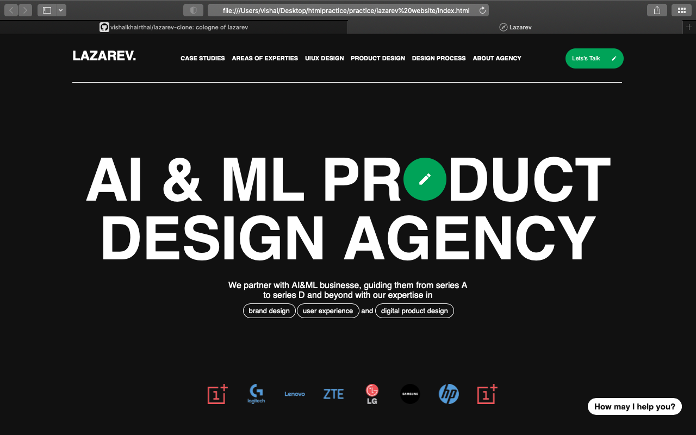
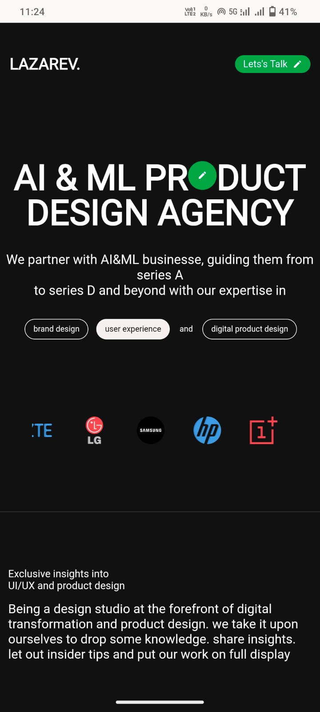

---

## 🌐 Live Demo

🔗 [View Live Project](https://lazarev-clone-delta.vercel.app/)

---

## 📸 Screenshots

### 💻 Desktop View



### 📱 Mobile View



---

## ✨ Features

- Smooth scroll-triggered animations
- Modern dark UI design
- Fully responsive layout
- Interactive sections and hover effects
- GSAP-powered motion effects
- Clean typography and visual hierarchy
- Marquee animations
- Structured multi-section landing page
- Mobile-first responsive improvements
- Minimal and immersive user experience

---

## 🛠️ Tech Stack

- HTML5
- CSS3
- JavaScript (Vanilla JS)
- GSAP (GreenSock Animation Platform)

---

## 📂 Folder Structure

bash
├── assets
├── screenshots
├── index.html
├── style.css
├── script.js
└── README.md


---

## 🧠 What I Learned

While building this project, I improved my understanding of:

- Scroll-triggered animations
- GSAP fundamentals
- Responsive web design
- Modern frontend layouts
- Typography and spacing systems
- UI/UX visual hierarchy
- Mobile responsiveness
- Animation timing and interaction flow

---

## ⚡ Performance & Responsiveness

The project is optimized for:

- Desktop screens
- Tablets
- Mobile devices
- Smooth scrolling experience
- Responsive typography and layouts

---

## ⚠️ Disclaimer

This project is a frontend clone created for learning and portfolio purposes only.

All design inspiration and original concepts belong to Lazarev.

---

## 👨‍💻 Connect With Me

- LinkedIn: https://www.linkedin.com/in/vishal-gupta-26b515218
- GitHub: https://github.com/vishalkhairthal

---

## ⭐ Support

If you liked this project, consider giving it a star on GitHub.

```
